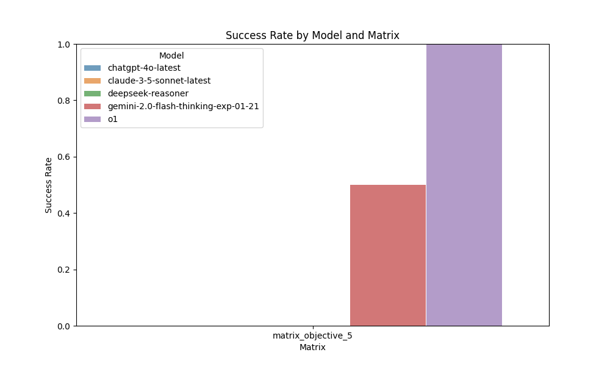
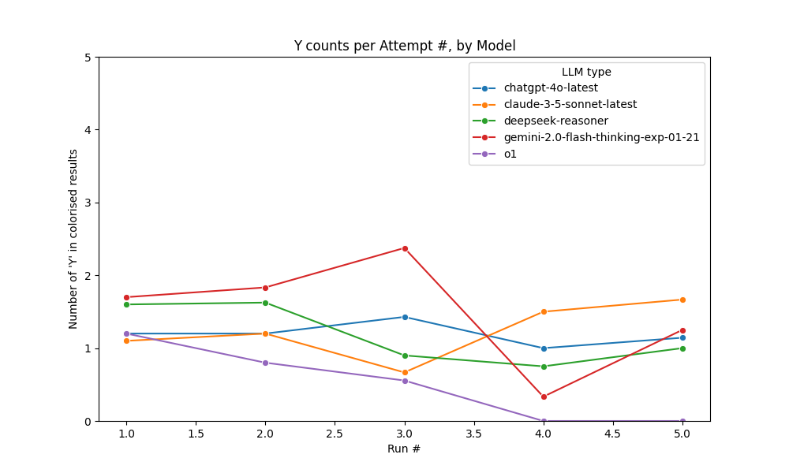

# LOOP-Evals
Logical Operations On Problems: The idea is to test simple Iterative Reasoning tests for LLMs, through puzzles which are hard to solve and easy to evaluate.

# Why?
LLMs are hard to evaluate, as [I've written multiple times](https://www.strangeloopcanon.com/p/evaluations-are-all-we-need), and their ability to reason is difficult to separate from what they're trained on. So I wanted to find a way to test its ability to iteratively reason and answer questions. 

I started with the simplest version of it I could think of that satisfies the criteria: namely whether it can create wordgrids, successively in 3x3, 4x4 and 5x5 sizes. Why this? Because evaluations should be a) easy to create, AND b) easy to evaluate, while still being hard to do!

The second is ... Wordle. Same principle!

The third is ... Sudoku! The pastime that was meant to be both fun and a cure for dementia, but seemingly once again surprisingly hard for LLMs to solve!

# How
Let's start with the wordgrids. First it asks LLMs to create word grids with minimal constraints (starting word starts with C and last word ends with N) in 3 sizes - 3x3, 4x4, and 5x5.

The test is whether they can create them. It tries this over 50 attempts in the attached code, each attempt having 10 turns each, each turn using the previously generated word grid and asking it to think through and edit it such that they're valid.

Add your openai api key to .env file, make any edits to info.json if you want to change anything and run wordgrid.py. By default its set to gpt-4, and runs 50 Attempts with 10 Runs each, feel free to test other groupings 

Afterwards run analysis_wg.py to do the necessary analysis and make a few pretty charts. Same again for analysis_wordle.py

# Results
From the wordgrid run, we can see the results, which really aren't spectacular in favour of LLMs. It's very similar for the reasoning models too.

Or

Similarly, from the wordle run we can see similar trends as well ...

# Next steps
There are many other such evaluations I want to create. Next up is likely sudokus and cipher puzzles, which also require iterative reasoning while also meeting our criteria.

The goal is: a) get a broad set of such evaluations that meaningfully help us understand general reasoning, b) can continue to be useful as LLMs scale and new architectures develop, and c) help us learn how we learn so we can use that reasoning data to maybe teach AI!

I see this as something that will grow across domains and workflows, just as software did and computerisation before that. This is not only essential to the development of AGI, but a crucial area for us to learn how to use AI, this magical new portal into weird intelligence we've developed!
